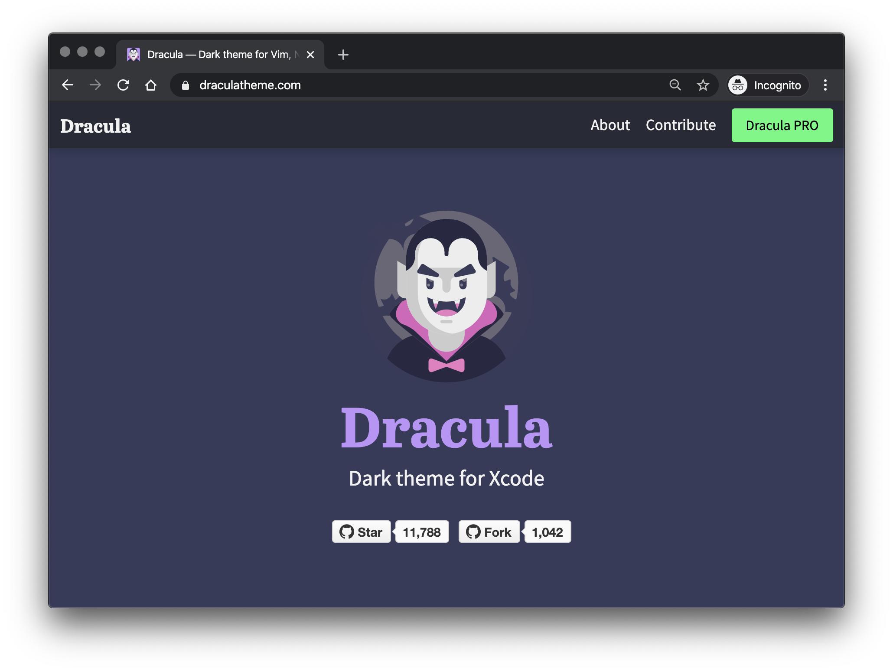

# draculatheme.com

> This repo contains the source code for [draculatheme.com](https://draculatheme.com).



## How it works?

We use [Next.js](https://nextjs.org/), a React framework that does static exporting.

## Getting Started

1. Install [NodeJS](http://nodejs.org/download/), if you don't have it yet.

2. Now clone this repository:

   ```sh
   $ git clone https://github.com/dracula/draculatheme.com.git
   ```

3. Then go to the project's folder:

   ```sh
   $ cd draculatheme.com
   ```

4. Install all dependencies:

   ```sh
   $ yarn
   ```

5. Generate a [GitHub Personal Access Token](https://help.github.com/en/enterprise/2.17/user/authenticating-to-github/creating-a-personal-access-token-for-the-command-line) with `repo` permissions and create a `.env` file containing this variable.

   ```sh
   GITHUB_PERSONAL_ACCESS_TOKEN=cdf5fa84cc07c2ea66fae8f2140118c9e9fa4f55
   ```

6. And finally run:

   ```sh
   $ yarn dev
   ```

Now you can see the website running in `localhost:3000` :D

## Deploy

If you're a collaborator, you can publish the site to GitHub Pages by running:

```sh
$ yarn deploy
```

## Community

- [Twitter](https://twitter.com/draculatheme) - Best for getting updates about themes and new stuff.
- [GitHub](https://github.com/dracula/dracula-theme/discussions) - Best for asking questions and discussing issues.
- [Discord](https://draculatheme.com/discord-invite) - Best for hanging out with the community.

## License

[MIT License](./LICENSE) © Dracula Theme
