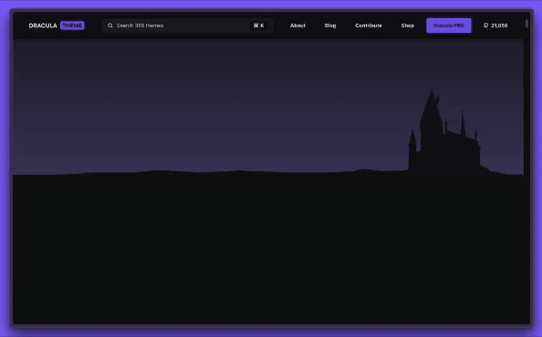

# draculatheme.com

> This repo contains the source code for [draculatheme.com](https://draculatheme.com).



## Getting Started

1. Install [NodeJS](http://nodejs.org/download/), if you don't have it yet.

2. Now clone this repository:

   ```sh
   $ git clone https://github.com/dracula/draculatheme.com.git
   ```

3. Then go to the project's folder:

   ```sh
   $ cd draculatheme.com
   ```

4. Install all dependencies:

   ```sh
   $ npm install
   ```

5. And finally run:

   ```sh
   $ npm run dev
   ```

Now you should see the website running in `localhost:3000` 😁

## Community

- [Twitter](https://twitter.com/draculatheme) - Best for getting updates about themes and new stuff.
- [GitHub](https://github.com/dracula/dracula-theme/discussions) - Best for asking questions and discussing issues.
- [Discord](https://draculatheme.com/discord-invite) - Best for hanging out with the community.

## License

[MIT License](./LICENSE) © Dracula Theme
