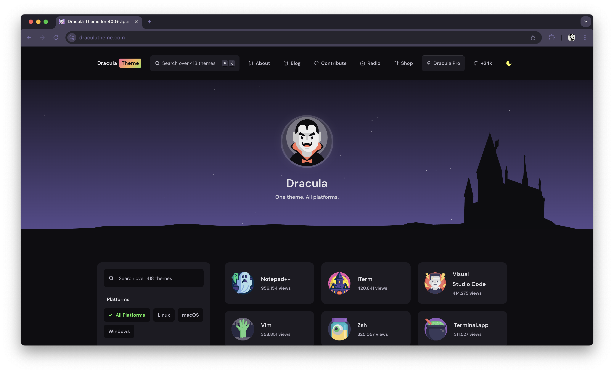

# Dracula Theme Website

> The official source code for [draculatheme.com](https://draculatheme.com) - the home of the Dracula color scheme.

[](https://draculatheme.com)

## Quick Start

**Prerequisites:** [Node.js](https://nodejs.org/download) (v16 or higher recommended)

```bash
git clone https://github.com/dracula/draculatheme.com.git
cd draculatheme.com
npm install
npm run dev
```

The website will be available at `http://localhost:3000`

## Available Scripts

| Command         | Description                               |
| --------------- | ----------------------------------------- |
| `npm run dev`   | Start development server with Turbopack   |
| `npm run build` | Build for production                      |
| `npm run start` | Start production server                   |
| `npm run rss`   | Generate RSS feeds for blog and changelog |
| `npm run lint`  | Run ESLint and Prettier                   |

## Contributing

1. Fork the repository.
2. Create your feature branch (`git checkout -b feat/amazing-feature`).
3. Commit your changes (`git commit -m 'feat: add amazing feature'`).
4. Push to the branch (`git push origin feat/amazing-feature`).
5. Open a Pull Request! 💜

## Community

Join the Dracula community:

- **[Twitter](https://twitter.com/draculatheme)** - Latest updates and announcements.
- **[GitHub Discussions](https://github.com/dracula/dracula-theme/discussions)** - Questions and technical discussions.
- **[Discord](https://draculatheme.com/discord-invite)** - Real-time chat with the community.

## Dracula Pro

[](https://draculatheme.com/pro)

## License

This project is licensed under the [MIT License](./LICENSE). Made with 💜 by [Zeno](https://zenorocha.com) and [Luxonauta](https://luxonauta.com).
